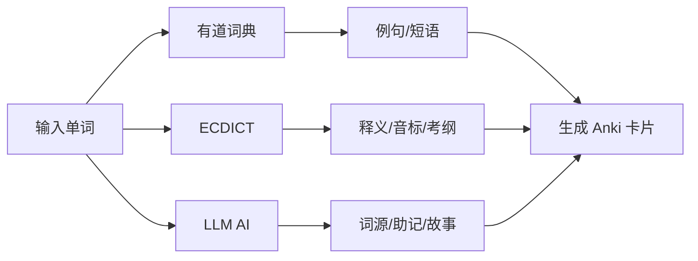

# LLM 功能分析文档

## 📋 概述

本项目使用 **LiteLLM** 框架来统一调用各种 LLM 服务，用于增强 Anki 单词卡片的学习内容。

---

## 🎯 LLM 实现的核心功能

### 1. **词源分析（Etymology）**
- 详细介绍单词的造词来源和发展历史
- 解释单词在欧美文化中的内涵
- 帮助理解单词的深层含义

### 2. **助记方法（Mnemonic）**
提供两种记忆方法：
- **联想记忆（Associative）**：通过联想帮助记住单词含义
- **谐音记忆（Homophone）**：通过谐音帮助记住单词拼写

### 3. **词形变化（Tenses）**
- 列出单词的所有词形变化
- 包括：动词时态、形容词、名词、副词等形式
- 格式：`v. 原形, 过去式, 过去分词, 现在分词; adj. 形容词; n. 名词; adv. 副词`

### 4. **情境故事（Story）**
- **英文故事**：80-100 词的场景故事，包含目标单词
- **中文翻译**：保持与英文版一致的语气和画面感
- 使用简单易懂的词汇，突出单词使用场景

---

## 🔧 技术实现

### 核心代码结构

```
anki_packager/
├── ai.py          # LLM 调用逻辑
├── prompt.py      # Prompt 模板
└── cli.py         # 集成到主流程
```

### 1. **ai.py - LLM 封装类**

```python
class llm:
    def __init__(self, model_param: list):
        # 使用 LiteLLM Router 统一管理多个模型
        model_list = [
            {
                "model_name": "a",  # 统一别名
                "litellm_params": param,
            }
            for param in model_param
        ]
        self.router = Router(model_list)
    
    async def explain(self, word: str) -> Dict:
        # 调用 LLM 生成结构化 JSON 响应
        response = await self.router.acompletion(
            model="a",
            messages=[
                {"role": "system", "content": PROMPT},
                {"role": "user", "content": word},
            ],
            temperature=0.3,
            max_tokens=500,
            response_format={"type": "json_object"},  # 强制 JSON 输出
        )
        # 使用 Pydantic 模型验证和解析响应
        validated_data = WordExplanation.model_validate(data)
        return validated_data.model_dump()
```

### 2. **Pydantic 数据模型**

```python
class Mnemonic(BaseModel):
    associative: str  # 联想记忆
    homophone: str    # 谐音记忆

class Origin(BaseModel):
    etymology: str    # 词源
    mnemonic: Mnemonic

class Story(BaseModel):
    english: str      # 英文故事
    chinese: str      # 中文翻译

class WordExplanation(BaseModel):
    word: str
    origin: Origin
    tenses: str       # 词形变化
    story: Story
```

### 3. **Prompt 设计**

位于 `prompt.py`，指导 LLM 输出符合要求的 JSON 格式：

```json
{
  "word": "reform",
  "origin": {
    "etymology": "来自拉丁语...",
    "mnemonic": {
      "associative": "联想记忆：re(重新) + form(形成) = 改革",
      "homophone": "谐音记忆：瑞丰(给形) → 重新塑形 → 改革"
    }
  },
  "tenses": "v. reform, reformed, reformed, reforming; n. reform",
  "story": {
    "english": "The government decided to reform...",
    "chinese": "政府决定改革..."
  }
}
```

---

## ✅ 是否支持本地 Ollama？

### **答案：完全支持！** 🎉

从你的配置文件可以看到已经配置了本地 Ollama：

```toml
[[MODEL_PARAM]]
model = "ollama/gemma3:27b"
api_base = "http://localhost:11434"
rpm = 10
```

### 支持的 LLM 服务

通过 LiteLLM，本项目支持以下所有服务：

#### 1. **本地服务**
- ✅ **Ollama**（你当前使用的）
- ✅ LM Studio
- ✅ LocalAI
- ✅ vLLM

#### 2. **云端服务**
- ✅ OpenAI (GPT-4, GPT-3.5)
- ✅ Google Gemini（配置中有示例）
- ✅ Anthropic Claude
- ✅ Azure OpenAI
- ✅ Cohere
- ✅ HuggingFace
- ✅ 国内大模型：通义千问、文心一言、智谱 AI 等

---

## 📝 配置示例

### 当前配置（Ollama 本地）

```toml
[[MODEL_PARAM]]
model = "ollama/gemma3:27b"           # Ollama 模型
api_base = "http://localhost:11434"   # Ollama 服务地址
rpm = 10                               # 每分钟请求数限制
```

### 其他配置示例

#### OpenAI / OpenAI-Compatible API
```toml
[[MODEL_PARAM]]
model = "openai/gpt-4o"
api_key = "sk-..."
api_base = "https://api.openai.com/v1"  # 可选
rpm = 200
```

#### Google Gemini
```toml
[[MODEL_PARAM]]
model = "gemini/gemini-2.0-flash-exp"
api_key = "YOUR_GEMINI_API_KEY"
rpm = 10
```

#### 混合配置（多模型负载均衡）
```toml
# 本地 Ollama
[[MODEL_PARAM]]
model = "ollama/qwen2.5:14b"
api_base = "http://localhost:11434"
rpm = 10

# 云端 Gemini 作为备用
[[MODEL_PARAM]]
model = "gemini/gemini-2.0-flash-exp"
api_key = "YOUR_API_KEY"
rpm = 15
```

LiteLLM Router 会自动在多个模型间分配请求，实现负载均衡。

---

## 🎨 AI 生成内容在卡片中的展示

在 Anki 卡片背面会显示：

```
【释义】
n. 改革；改良
v. reform, reformed, reformed, reforming

【词源】
reform 来自拉丁语 reformare，由 re-（重新）+ formare（塑形）构成...

【联想助记】
re(重新) + form(形成) = 改革，重新塑造形态

【谐音助记】
瑞丰(给形) → 重新塑形 → 改革

【故事】
The government decided to reform the education system...

政府决定改革教育系统...
```

---

## 🔄 工作流程



1. **并发获取数据**：同时调用有道、ECDICT、AI
2. **AI 处理**：调用 LLM 生成词源、助记、故事
3. **数据验证**：使用 Pydantic 验证 JSON 格式
4. **卡片生成**：组合所有数据生成 Anki 卡片

---

## ⚙️ 性能与并发

### 并发控制
```python
CONCURRENCY_LIMIT = 40  # 最大并发数
MAX_RETRIES = 3         # 失败重试次数
RETRY_DELAY = 2         # 重试延迟（秒）
```

### RPM（每分钟请求数）限制
在配置中设置 `rpm` 参数，LiteLLM 会自动控制请求速率：
```toml
rpm = 10  # Ollama 本地可以设置较低值
```

---

## 🚀 优势

### 1. **灵活性**
- 一份配置支持所有主流 LLM
- 可随时切换模型而无需修改代码

### 2. **可靠性**
- 支持多模型负载均衡
- 自动重试机制
- Pydantic 数据验证确保输出质量

### 3. **本地优先**
- 支持 Ollama 等本地模型
- 无需担心 API 费用
- 数据隐私更有保障

### 4. **增强学习效果**
- AI 生成的词源和助记法更生动
- 情境故事帮助理解单词用法
- 多维度内容提升记忆效果

---

## 🛠️ 禁用 AI 功能

如果不想使用 AI 功能：

```bash
python -m anki_packager --disable_ai
```

此时卡片将只包含：
- 有道词典例句
- ECDICT 释义
- 音标、考纲标签
- 词典辨析

---

## 📊 实际运行示例

从你的运行日志可以看到：

```
[cli.py:154:main] 当前使用的 AI 模型: ['ollama/gemma3:27b']
[cli.py:191:main] 从默认词库读取了 2 个单词
[cli.py:213:main] 开始并发处理 2 个单词...
'reform' 添加成功: 100%
[cli.py:240:main] 所有单词均已成功处理！
```

**成功使用本地 Ollama gemma3:27b 模型处理了 2 个单词！** ✅

---

## 🎯 总结

1. **LLM 用途**：生成词源、助记法、词形变化、情境故事
2. **技术栈**：LiteLLM + Pydantic + Async
3. **Ollama 支持**：✅ 完全支持，你已经成功配置并运行
4. **灵活性**：可切换任意 LLM 服务，支持多模型负载均衡
5. **增强效果**：AI 生成的内容大幅提升单词学习质量

你的 Ollama 本地服务运行良好！🎉

